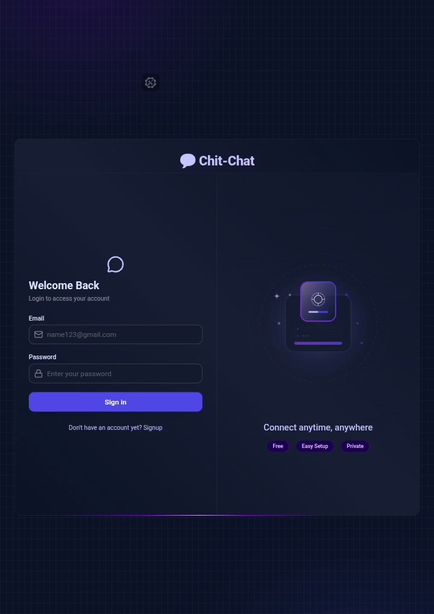
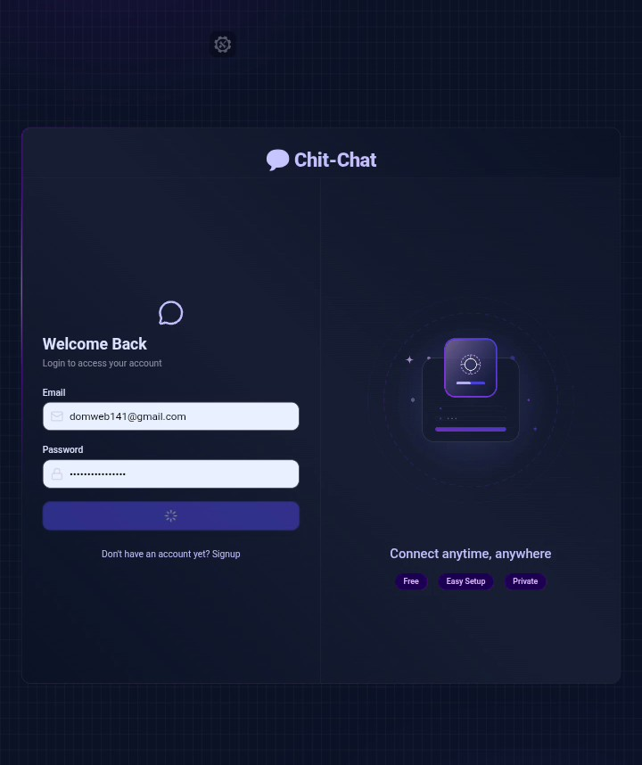
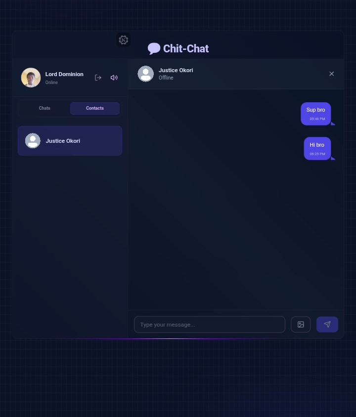

# 💬 Chit-Chat

A modern full-stack real-time messaging platform...

A modern full-stack real-time messaging platform built with the MERN stack. Chit-Chat enables secure user authentication, instant messaging through WebSockets, email verification, and cloud-based profile management.

---

🚀 Features

⚡ Real-Time Messaging

- Instant message delivery powered by Socket.IO
- Persistent WebSocket connections for low-latency communication
- Online user presence tracking
- Responsive chat experience across devices

🔐 Secure Authentication

- JWT-based authentication system
- Secure "httpOnly" cookie storage
- Protected API routes and user sessions
- Email verification workflow

📧 Automated Email Verification

- Gmail REST API integration using OAuth2
- Reliable email delivery without traditional SMTP configuration
- Automated account verification system

☁️ Cloud Media Management

- Profile image uploads via Cloudinary
- Optimized cloud storage and image delivery
- Dynamic profile customization

🛡️ Security & Reliability

- Request rate limiting
- Input validation and sanitization
- Protected authentication flows
- Secure environment variable management

---

🏗️ Tech Stack

Frontend

- React.js
- Vite
- Zustand
- Tailwind CSS
- DaisyUI
- Lucide React
- React Hot Toast

Backend

- Node.js
- Express.js
- Socket.IO
- JSON Web Tokens (JWT)

Database

- MongoDB
- Mongoose

External Services

- Cloudinary
- Gmail REST API (Google OAuth2)

---

📂 Project Structure

frontend/
├── src/
│   ├── components/
│   ├── pages/
│   ├── store/
│   └── lib/

backend/
├── controllers/
├── middleware/
├── models/
├── routes/
├── lib/
└── socket/

---

⚙️ Environment Variables

Create a ".env" file inside the "backend" directory:

PORT=3000
NODE_ENV=development

MONGO_URL=your_mongodb_connection_string
JWT_SECRET=your_jwt_secret

CLIENT_URL=http://localhost:5173

# Cloudinary
CLOUDINARY_CLOUD_NAME=
CLOUDINARY_API_KEY=
CLOUDINARY_API_SECRET=

# Gmail OAuth2
GMAIL_USER=
GOOGLE_CLIENT_ID=
GOOGLE_CLIENT_SECRET=
GOOGLE_REFRESH_TOKEN=

EMAIL_FROM_NAME=Chit-Chat

---

🚀 Getting Started

1. Clone the Repository

git clone <repository-url>
cd chit-chat

2. Install Dependencies

# Frontend
cd frontend
npm install

# Backend
cd ../backend
npm install

3. Configure Environment Variables

Create the ".env" file and add the required values.

4. Start the Application

# Backend
npm run dev

# Frontend
npm run dev

---

🎯 Future Improvements

- Group chats
- Message reactions
- File sharing
- Voice messages
- Video calling
- Push notifications
- Message search functionality
- User blocking and reporting

---

👨‍💻 Author

Lord Dominion

Built to explore modern web development practices, real-time communication systems, and secure authentication workflows.